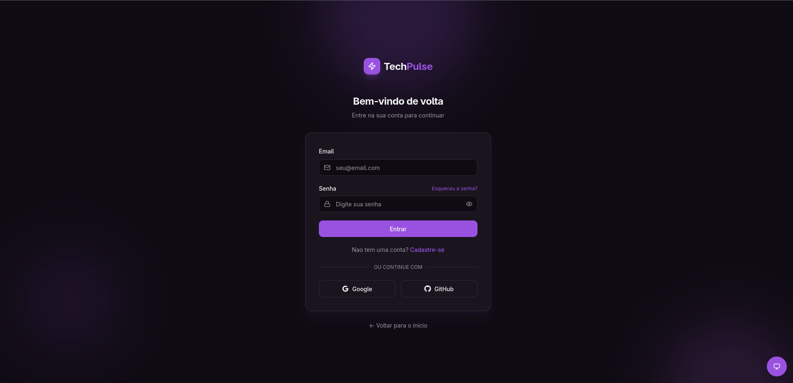
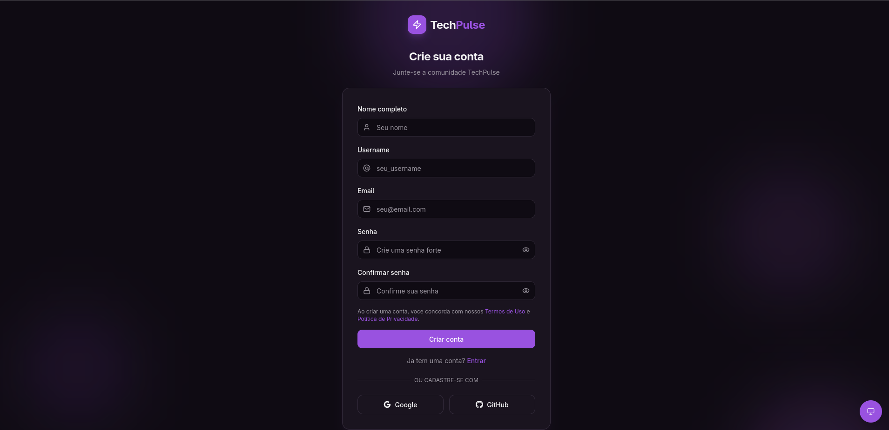

# Frontend – Documentação Técnica

## 📌 Visão Geral

Este repositório contém o frontend da aplicação, desenvolvido com foco em organização, escalabilidade e boas práticas de engenharia de software.

## 🧱 Arquitetura

* Separação clara de responsabilidades
* Componentização
* Comunicação com backend via API REST

## ⚙️ Tecnologias Utilizadas

* HTML5
* CSS3
* JavaScript
* Frameworks e bibliotecas conforme o projeto

## ▶️ Como Executar o Projeto

```bash
# instalar dependências
npm install

# executar em modo desenvolvimento
npm run dev
```

## 🖼️ Telas da Aplicação

Nesta seção estão algumas imagens das principais telas do frontend, com o objetivo de demonstrar a interface, usabilidade e fluxo da aplicação.

### 🔐 Tela de Login

> Descrição: Tela responsável pela autenticação do usuário no sistema.



### 🏠 Dashboard

> Descrição: Visão geral do sistema após o login, contendo informações principais e atalhos.


### 📰 Listagem de Notícias

> Descrição: Tela que exibe as notícias cadastradas, com filtros e opções de visualização.


### ✏️ Cadastro / Edição

> Descrição: Formulário utilizado para cadastro ou edição de registros.



> 📌 **Observação:**
>
> * As imagens devem estar localizadas em `docs/images/`.
> * Utilize nomes claros e padronizados para facilitar a manutenção do projeto.

## 📂 Estrutura de Pastas

```text
src/
 ├─ assets/
 ├─ components/
 ├─ pages/
 ├─ services/
 └─ utils/
```

## 🔐 Boas Práticas

* Uso de variáveis de ambiente
* Padronização de commits
* Versionamento com Git e GitHub

## 📄 Licença

Este projeto está sob a licença definida pelo autor.
